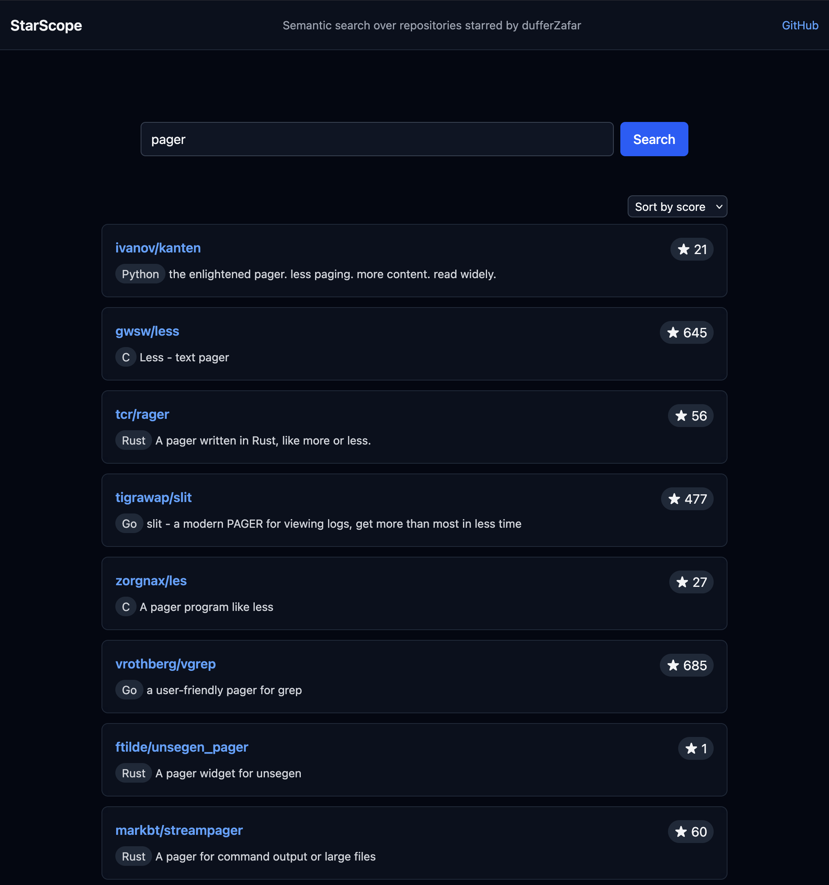

# StarScope

Semantic search over my starred github repositories.

## Phase 1 - Semantic Search

* Allows searching for stars not just via metadata
    - But also by their semantic content in plain english

* Vector embeddings
    - `BAAI/bge-small-en-v1.5`
        - Could try other freely available models

* Single .duckdb file for storage
    - `stars` table for repo metadata
    - `repo_reps` table for repo representative embeddings
    - can be loaded from the web (via wasm) or from cli

* Fetching, cleaning, chunking, processing done in Python

* vue.js + tailwind frontend

## Phase 2 - Clustering visulisation

* Use d3.js or webgl lib to display clusters of repositories

## Prior Art

* https://github.com/LuisReinoso/github-stars-semantic-search
    - Live demo: https://luisreinoso.dev/github-stars-semantic-search/
    - OpenAI Embeddings, stored in PgLite
    - Processes Readme files
    - Requires auth tokens!

* https://github.com/SushantDaga/github-stars-search
    - "intelligent chunking strategies"
    - BAAI/bge-small-en-v1.5 via txtai
    - hybrid search combining neural embeddings and BM25 keyword search
    - incremental updates for newly starred repositories

* https://github.com/JaosnHsieh/github-star-search
    - No embeddings, just fuzzy search

* https://github.com/prabirshrestha/gh-stars
    - Rust
    - Keyword + vector search using embeddings

* https://github.com/BjornMelin/stardex
    - d3.js viz of repo clusters
    - scikit-learn Clustering
    - No embeddings?